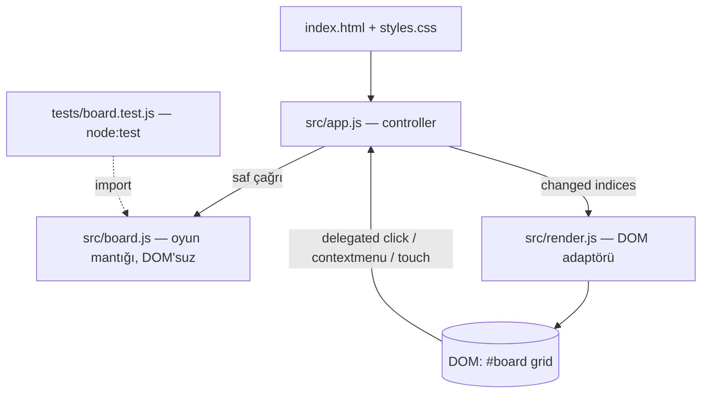
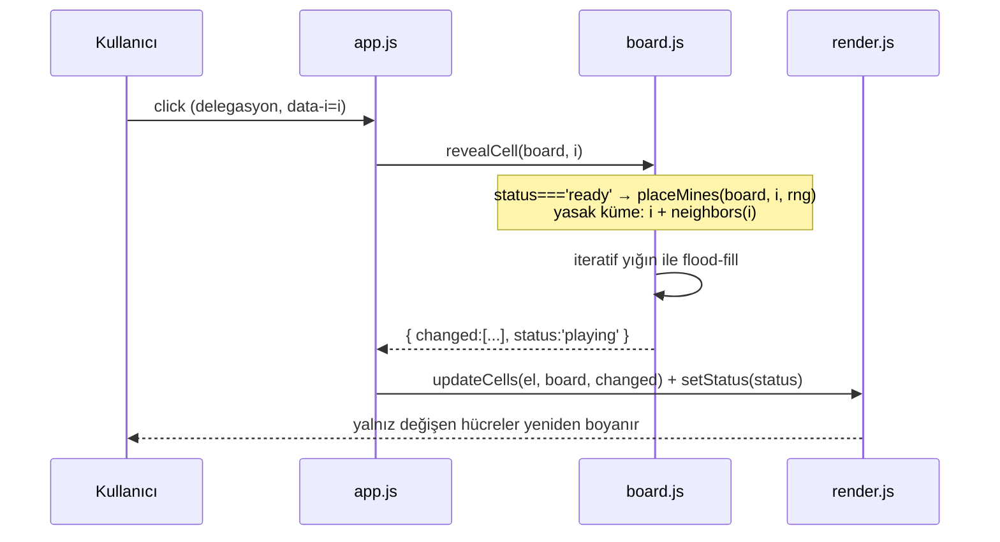

# 05 — Mimari Tasarım: minesweeper

- Tarih: 2026-07-26 | Mod: AUTOPILOT | Profil: LITE
- Girdi: `docs/03-requirements.md`, `docs/04-solution-analysis.md` | Ürün tipi: web (statik)

## Bileşen görünümü

Kural: **`board.js` DOM'a, `render.js` oyun kurallarına DOKUNMAZ**; ikisini yalnız `app.js` bağlar.

## Veri akışı (ilk tık — FR-2/NFR-4)


## Veri modeli
```js
Board = {
  rows, cols, mines,            // zorluktan gelir (DIFFICULTIES)
  cells: [ { mine: boolean, adj: 0..8, state: 'hidden'|'revealed'|'flagged' } ],  // uzunluk = rows*cols
  status: 'ready' | 'playing' | 'won' | 'lost',
  revealedCount, flagCount
}
// index = r * cols + c   → aynı indeks DOM'daki hücre <div>'inin sırasıdır (DL-04-004)
DIFFICULTIES = { easy:{9,9,10}, medium:{16,16,40}, hard:{rows:16, cols:30, mines:99} }
```

## Public arayüzler (Faz 9 bu imzalara göre kod yazar)
| Modül | Dışa verilen | Sözleşme |
|---|---|---|
| `src/board.js` | `DIFFICULTIES` | 3 sabit zorluk (FR-1) |
| | `createBoard(key)` → `Board` | `status:'ready'`, tüm hücreler `hidden`, mayın YOK |
| | `neighbors(board, i)` → `number[]` | 3-8 komşu; satır taşması yasak (tek doğruluk kaynağı, NFR-2) |
| | `placeMines(board, safeIndex, rng=Math.random)` | Fisher-Yates; `safeIndex`+komşuları hariç; `adj` hesaplar; `status='playing'` |
| | `revealCell(board, i, rng?)` → `{changed:number[], status}` | `ready` ise önce `placeMines`; `flagged`/`revealed`/kilitli tahta → `changed:[]`; mayın → tüm mayınlar açılır + `lost`; flood-fill iteratif |
| | `toggleFlag(board, i)` → `{changed, flagsLeft}` | Yalnız `hidden`↔`flagged`; `playing`/`ready` dışında etkisiz (FR-3) |
| `src/render.js` | `mountBoard(el, board)` | Grid `<div>`'lerini BİR KEZ kurar (`data-i`), CSS `grid-template-columns` |
| | `updateCells(el, board, indices)` | Yalnız verilen indeksler: `className` + `textContent` |
| | `setStatus(el, board)` | "Kazandın"/"Kaybettin"/kalan bayrak (FR-4, FR-5) |
| `src/app.js` | `initApp(root)` | Zorluk seçimi + Yeniden Başlat (FR-1/FR-6) + tek delegasyon dinleyicisi (click / contextmenu / touchstart+500ms) |

Durum makinesi: `ready --ilk reveal--> playing --mayın--> lost` · `playing --tüm mayınsızlar açık--> won`; `won|lost` girdiyi yok sayar (tahta kilidi, FR-4).

## Teknoloji seçimleri
| Katman | Seçim | Alternatifler | DL |
|---|---|---|---|
| Dil/paketleme | Saf ES modülleri, derleme/bundler YOK (`<script type="module">`) | Vite+bundler, tek dosya IIFE | DL-05-002 |
| Mantık/DOM ayrımı | Saf çekirdek + ince DOM adaptörü | Tek dosya karma kod | DL-05-001 |
| Mayın yerleşimi | Tembel (ilk tıkta) Fisher-Yates | Kurulumda yerleştir + ilk tıkta taşı | DL-05-003, DL-04-001 |
| Flood-fill | İteratif yığın | Rekürsif DFS | DL-04-002 |
| Render | Hedefli `updateCells` + delegasyon | Tam yeniden çizim | DL-04-003 |
| Test | Node yerleşik `node:test` (yalnız `board.js`, DOM'suz) | jsdom, Jest, Playwright | DL-05-002 |
| Stil | Tek `styles.css`, CSS Grid | Inline stil, CSS framework | DL-05-001 |

## NFR ↔ Mimari eşlemesi (kalite kapısı kanıtı)
| NFR | Mimarideki somut karşılığı |
|-----|-----------------------------|
| NFR-1 (tık→DOM ≤100ms, 16x30) | (a) `revealCell` iteratif O(n≤480), tahsis yok; (b) `updateCells` yalnız `changed` indekslerine yazar (tipik 1-20 düğüm, en kötü 480 nitelik yazımı) — `innerHTML` yeniden kurulumu yok; (c) olay delegasyonu: 480 değil **1** dinleyici; (d) render sırasında layout OKUMASI yok → reflow-thrash yok; (e) sanal DOM/reconciler katmanı yok |
| NFR-2 (komşu sayımı %100) | Komşuluk TEK `neighbors(board,i)` fonksiyonunda; `adj` yalnız `placeMines` içinde, her mayının komşularını artırarak üretilir (tek yazım noktası); `board.js` saf + DOM'suz olduğu için `node:test` ile köşe/kenar/orta hücreler ve "tüm `adj` toplamı = 8-komşuluk sayımı" invariantı doğrudan test edilir |
| NFR-3 (framework'süz, mobil+masaüstü) | Bağımlılık yok, derleme adımı yok; tarayıcı `<script type="module">` ile doğrudan yükler; test koşucusu Node'un yerleşiği (dev bağımlılığı bile yok); dokunmatik yol (500ms uzun-basma) ayrı girdi kanalı olarak `app.js`'te ele alınır; CSS Grid ile duyarlı yerleşim |
| NFR-4 (ilk tık asla mayın) | `createBoard` mayın ÜRETMEZ (`status:'ready'`) → yerleşim yapısal olarak ilk tıktan önce imkânsız; `placeMines(board, safeIndex)` yasak kümeyi (safeIndex + komşuları) havuza hiç almaz; `revealCell` tembel çağrının tek sahibidir → kaçak yol yok; RNG enjekte edilebilir olduğundan test binlerce tohumla ilk tıkta mayın olmadığını doğrular |

## ADR listesi
- DL-05-001: Modül ayrımı — saf oyun çekirdeği + ince DOM adaptörü + controller
- DL-05-002: Derlemesiz ES modülleri + `node:test` (sıfır bağımlılık)
- DL-05-003: Tembel mayın yerleşimi ve `ready→playing→won|lost` durum makinesi
- DL-05-004: Mutasyon fonksiyonlarının `changed[]` döndürme sözleşmesi (render girdisi)
- Devralınan: DL-04-001 (Fisher-Yates), DL-04-002 (iteratif flood-fill), DL-04-003 (hedefli render), DL-04-004 (1D state)

## Kalite kapısı raporu
- "Kritik NFR'lerin mimaride karşılığı var" → ✅ NFR-1..NFR-4'ün DÖRDÜ de yukarıdaki eşleme tablosunda somut mekanizmaya bağlandı (boş satır yok)
- "Bileşen + veri akışı diyagramı (Mermaid)" → ✅ `graph TD` + `sequenceDiagram`
- "Veri modeli tanımlı" → ✅ `Board` şeması + indeksleme kuralı + zorluk sabitleri
- "Teknoloji seçimleri DL'ye bağlı" → ✅ tablo, her satırda DL referansı
- Decision Log → ✅ DL-05-001, DL-05-002, DL-05-003, DL-05-004
