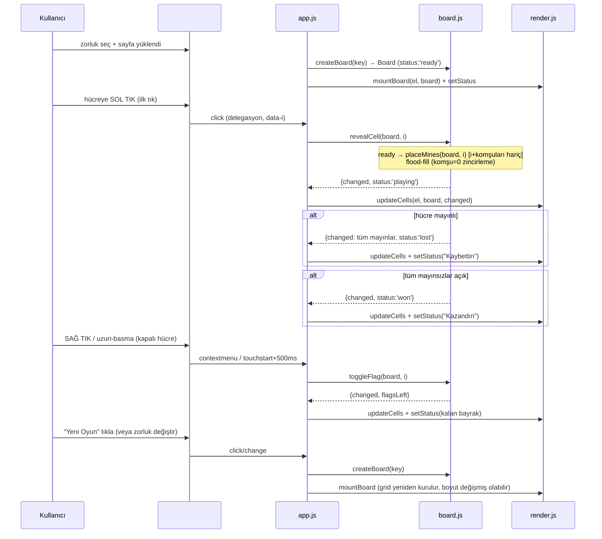

# 06 — UI/UX: minesweeper

- Tarih: 2026-07-26 | Mod: AUTOPILOT | Profil: LITE
- Ürün tipi: web → tek sayfa (statik HTML + vanilla JS, dinamik grid — bkz. `docs/05-architecture.md`)

Girdi: `docs/03-requirements.md` (FR-1..6, NFR-1..4), `docs/05-architecture.md`.

## Yüzey sözleşmesi (tek ekran)
| Öğe | Rol | Etkileşim | İlgili FR/NFR |
|-----|-----|-----------|----------------|
| Başlık `<h1>` "Mayın Tarlası" | Sayfa kimliği | — | — |
| Zorluk seçici `<select id="difficulty">` (Kolay/Orta/Zor) + "Yeni Oyun" `<button id="new-game">` | Zorluk + kurulum | Değişiklik/click → yeni tahta | FR-1, FR-6 |
| Izgara `
` (`rows*cols` hücre `role="gridcell"`, `data-i`) | Oyun tahtası | Sol tık: aç · Sağ tık/`contextmenu`: bayrak · Uzun-basma (touchstart ~500ms): bayrak | FR-2, FR-3 |
| Hücre (`.hidden`/`.revealed`/`.flagged`/`.mine`) | Durum gösterimi | Açık hücre: komşu sayısı (0 ise boş) veya mayın ikonu; bayraklı: 🚩 | FR-2, FR-3, FR-4 |
| Durum satırı `
` | Kazan/kaybet + kalan bayrak sayacı | Oyun bitince "Kazandın"/"Kaybettin"; oynanırken kalan bayrak | FR-4, FR-5 |

Yalnız fare (sol/sağ tık) + dokunmatik (tek dokunuş aç, uzun-basma bayrak) — klavye navigasyonu v1 kapsamı dışı (brief NFR-3 yalnız tarayıcı uyumluluğu ister, erişilebilirlik NFR'si tanımlanmadı).

## Ana akış — uçtan uca (kalite kapısı)

## Çıktı/görsel şablonları
- **Başlangıç durumu:** Tüm hücreler `.hidden` (düz gri kare); `#status` boş/"Kalan bayrak: N".
- **Oynama sırasında:** Açılan hücreler `.revealed` + komşu sayısı (1-8 renkli metin, klasik Minesweeper konvansiyonu — 1 mavi, 2 yeşil, 3 kırmızı...); 0 komşu → boş (metin yok); bayraklı hücreler `.flagged` 🚩 ikonu (NFR-1: tıktan DOM'a ≤100ms, 16x30 dahil).
- **Kaybetme durumu:** TÜM mayınlar `.mine` 💣 ikonuyla açılır (tıklanan mayın `.mine-triggered` kırmızı vurgu); tahta kilitlenir (yeni tıklama etkisiz); `#status` "💥 Kaybettin" (`aria-live` duyurur).
- **Kazanma durumu:** Tahta kilitlenir; `#status` "🎉 Kazandın" (`aria-live` duyurur).
- **Hata/kenar durumları:** Açık hücreye sağ tık → hiçbir şey değişmez (FR-3 kabul kriteri); bayraklı hücreye sol tık → açılmaz (FR-2); JS devre dışıysa `<noscript>` "Bu oyun JavaScript gerektirir" mesajı.

## Tasarım notları
- **Palet/kontrast:** Açık gri kapalı hücre, beyaz açık hücre, klasik sayı renk paleti (metin/arka plan kontrastı ≥4.5:1 hedefi); kırmızı yalnız kaybetme vurgusunda.
- **Boyut:** Bağımlılıksız 3 JS + 1 CSS + 1 HTML dosya, derleme yok (NFR-3).
- **Responsive:** Izgara CSS Grid (`grid-template-columns: repeat(cols, 1fr)`), `max-width` ile ortalanır; Zor (16x30) grid'de hücre boyutu küçülerek sığar — yatay scroll'a düşmez.
- **Ton:** Minimalist, coinflip/dice-game/sudoku ile tutarlı düz-renk arayüz; emoji yalnız durum/mayın/bayrak ikonlarında.

## Kalite kapısı raporu
- "Ana kullanıcı akışları uçtan uca çizildi" → ✅ GEÇTİ — tek ana akış (yükle → ilk tık/aç → bayrak → kazan/kaybet → yeni oyun) Mermaid ile uçtan uca verildi; başlangıç/oynama/kaybetme/kazanma/hata kenar durumları tanımlandı.
