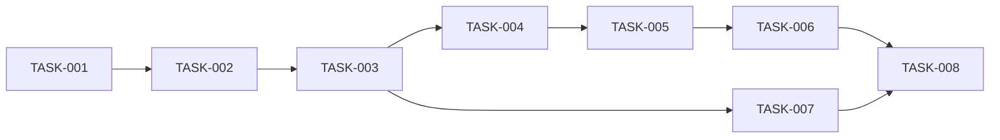

# 08 — Planlama: minesweeper

- Tarih: 2026-07-26 | Mod: AUTOPILOT | Profil: LITE

> LITE: milestone + önceliklendirilmiş backlog.

## Milestone'lar
| M | Hedef | Kapsanan FR'ler | Hedef tarih |
|---|-------|-----------------|-------------|
| M1 | Oynanabilir Minesweeper (tüm modüller + test + statik yüzey) | FR-1..FR-6 | 2026-07-27 |

## Backlog (önceliklendirilmiş)

### [M1] TASK-001: board.js çekirdek — createBoard/DIFFICULTIES/neighbors
- **Tahmin:** ≤1 gün
- **Bağımlılık:** —
- **FR:** FR-1
- **Kabul:** 3 zorluk sabiti doğru boyut/mayın sayısıyla `createBoard` üretir; `neighbors` sınır taşması yapmadan 3-8 komşu döner (test+impl, red→green).

### [M1] TASK-002: board.js — placeMines + revealCell (ilk-tık güvenli, flood-fill)
- **Tahmin:** ≤1 gün
- **Bağımlılık:** TASK-001
- **FR:** FR-2
- **Kabul:** İlk tık asla mayına denk gelmez (NFR-4); komşu=0 hücreler zincirleme açılır (test+impl, red→green).

### [M1] TASK-003: board.js — toggleFlag + kazan/kaybet durum geçişleri
- **Tahmin:** ≤1 gün
- **Bağımlılık:** TASK-002
- **FR:** FR-3, FR-4, FR-5
- **Kabul:** Bayrak yalnız hidden↔flagged geçer; tüm mayınsızlar açılınca `won`, mayına tıklanınca `lost` (test+impl, red→green).

### [M1] TASK-004: render.js — mountBoard/updateCells/setStatus
- **Tahmin:** ≤1 gün
- **Bağımlılık:** TASK-003
- **FR:** FR-1..FR-5
- **Kabul:** Yalnız `changed` indeksleri güncellenir; `textContent`/`className` kullanılır, `innerHTML` yok (SEC-1) (test+impl, red→green).

### [M1] TASK-005: app.js — zorluk seçimi + olay delegasyonu + yeniden başlatma
- **Tahmin:** ≤1 gün
- **Bağımlılık:** TASK-004
- **FR:** FR-1, FR-6
- **Kabul:** Tek delegasyon dinleyicisi (click/contextmenu/touchstart+500ms); zorluk allowlist ile seçilir (SEC-3) (test+impl, red→green).

### [M1] TASK-006: index.html + styles.css statik yüzey
- **Tahmin:** ≤1 gün
- **Bağımlılık:** TASK-005
- **FR:** Faz 6 sözleşmesi
- **Kabul:** CSP meta etiketi (SEC-5), CSS Grid ile duyarlı tahta, Faz 6 DOM sözleşmesine uyum.

### [M1] TASK-007: Entegrasyon testleri (ilk-tık bin tohum, komşu sayımı invariantı, kilitli-tahta)
- **Tahmin:** ≤1 gün
- **Bağımlılık:** TASK-003
- **FR:** NFR-2, NFR-4
- **Kabul:** 1000 rastgele tohumda ilk tık hiç mayına denk gelmez; her hücrenin `adj` değeri gerçek komşu mayın sayısına eşit; won/lost sonrası girdi etkisiz.

### [M1] TASK-008: npm test yeşil + coverage + DL-09-001 + kapı doğrula
- **Tahmin:** ≤1 gün
- **Bağımlılık:** TASK-006, TASK-007
- **FR:** Faz 9 kapanışı
- **Kabul:** `npm test` tümü yeşil, coverage ≥%70, DL-09-001 yazıldı, `verify-gate.mjs 9 --level all` geçti.

## Bağımlılık grafı (kalite kapısı: çevrimsiz)

## Kalite kapısı raporu
- "Her task 1 günden küçük" → ✅ (her TASK "Tahmin: ≤1 gün")
- "Bağımlılık grafı çevrimsiz" → ✅ (doğrusal zincir + TASK-007 yan dalı, geri dönüş yok)
